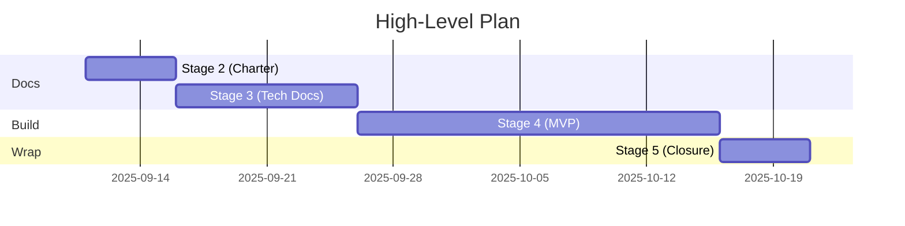

# Project Charter — Code Graph Explorer (MVP)

> Stage 2: Project Charter Development (C#26) — Single-file deliverable

## Project Info
- **Project Name**: code_graph_explorer
- **Version**: v0.1
- **Date**: 2025-08-12
- **Authors**: Pierre Lionnel Obiang, Ryota Higa, Jerome Tran
- **Share Link**: (to be added after pushing to GitHub/Docs)

---

## 1) Project Objectives

### Purpose (Why now?)
Learners need a fast way to **visualize multi-language codebases** and understand **file structure** and **function relationships**. This MVP imports ZIP/GitHub repos, parses sources, and renders both **graph** and **tree** views to accelerate learning.

### SMART Objectives (2–3)
| # | Objective | Metric | Baseline | Target | Deadline | Owner |
|---|---|---|---|---|---|---|
| 1 | Implement ZIP/GitHub import → parse → file/function graph generation | Node/edge correctness across 10 sample repos (test pass rate) | 0% | ≥80% | 2025-10-09 | Tech Lead (Jerome) |
| 2 | Render graph/tree with search/filter for ≤100 files **within 2s** on first paint | First render latency (local measure) | — | ≤2s | 2025-10-16 | Frontend (Ryota) |
| 3 | Provide project **save/load** and **read-only share link** | E2E success & viewable via share URL | — | 100% success | 2025-10-23 | Backend (Pierre) |

---

## 2) Stakeholders & Team Roles

### Stakeholders
**Internal**
- Team: Pierre Lionnel Obiang / Ryota Higa / Jerome Tran
- Mentors / Instructors

**External**
- Target users: learners/classmates (small–mid repos)
- External collaborators/partners: none (add if arises)

### Roles & Responsibilities
| Role | Person | Key Responsibilities | Backup |
|---|---|---|---|
| **Project Manager (PM)** | **Jerome Tran** | Planning, progress & issue tracking, ceremonies, external comms | Pierre |
| Tech Lead | Jerome Tran | Tech choices, design reviews, unblocking, quality bar | Ryota |
| Developer (Backend) | Pierre Lionnel Obiang | Parsing/API/save-load/share link | Ryota |
| Developer (Frontend) | Ryota Higa | Graph/Tree UI, search/filter, perf | Jerome |
| QA/Docs (rotation) | All | Test planning, reviews, README/diagrams, Swagger draft | — |

---

## 3) Scope

### In-Scope (MVP)
- ZIP upload & unzip
- GitHub repo read (read-only)
- Static parsing for **C / Python / JavaScript / HTML / CSS** (basic level)
- File **tree** view
- Function detection & **call relationships (edges)**
- **Graph** (nodes/edges) & **tree** rendering
- Search & simple filters
- **Save/Load** (local or server-side storage)
- **Read-only share link**
- *(Stretch)* WebSocket progress updates (fallback: polling)

### Out-of-Scope (for now)
- Advanced/3D visualization; AI refactoring suggestions
- Full user profiles / follow / notifications
- RBAC, MFA, payments
- Very large monorepo optimization (>5k files), distributed processing
- Code execution/evaluation, IDE integration (LSP)

---

## 4) Risks & Mitigations

| ID | Risk | Likelihood | Impact | Mitigation | Owner | Trigger | Plan B |
|---|---|---|---|---|---|---|---|
| R1 | Steep learning curve (Django/Next/React/Graph/WebSocket) | M | H | 1-day spike/POC per tech in week 1; design reviews to confirm scope | Tech Lead | POC stalls | Use polling instead of WS |
| R2 | Multi-language parsing accuracy | M | H | Limit languages; minimal signature extraction; TDD | Backend | Rising test failures | Prioritize JS/Py; defer C |
| R3 | Underestimation | M | M | Weekly buffer; WIP limits; clear priorities | PM | Milestone slip | Scope cut (defer stretch) |
| R4 | Integration complexity (Django API × Next UI × WS) | M | M | Start with REST; minimal WS; lock contracts in Swagger | Tech Lead | Frequent integration bugs | Ship REST + polling |
| R5 | Member availability | L | H | Backup assignees per task; shared reviews | PM | Delayed comms | Reassign tasks / extend deadlines |

---

## 5) High-Level Plan

| Phase | Dates | Deliverables | Exit Criteria | Owner |
|---|---|---|---|---|
| Stage 1: Idea Development | Done | Idea summary, value proposition | Team agreement | All |
| Stage 2: Project Charter | 2025-09-11 – 2025-09-17 | This document v1 | Sections 1–5 done & reviewed | PM (Jerome) |
| Stage 3: Technical Docs | 2025-09-18 – 2025-10-01 | Arch & data model, API spec (Swagger draft), test strategy | Design decisions approved | Tech Lead (Jerome) |
| Stage 4: MVP Development | 2025-10-02 – 2025-10-30 | Import/parse/visualize; save/load; share link; (WS = stretch) | SMART #1–#3 met | Dev (Pierre/Ryota) |
| Stage 5: Closure | 2025-10-31 – 2025-11-07 | Presentation, demo, retro, final docs | Demo success; submission | All |

Mermaid Gantt (optional)

---

## Assumptions & Constraints
- **Assumptions**: Target languages are C/Py/JS/HTML/CSS; static analysis only (no code execution).
- **Constraints**: Team of 3; weekdays focus (2–3h/day each). MVP in ~5–6 weeks; remaining time for extensions and presentation prep.

---

## Share your document
- **Project Charter (view-only)**: [ add link here ]
- (Optional) Tech Docs: [  ]
- (Optional) Repo: [  ]

---

## Change Log
| Date | Ver | Change | Author |
|---|---|---|---|
| 2025-09-11 | v0.1 | Initial draft (Stage 2), estimates & roles | Ryota Higa |

