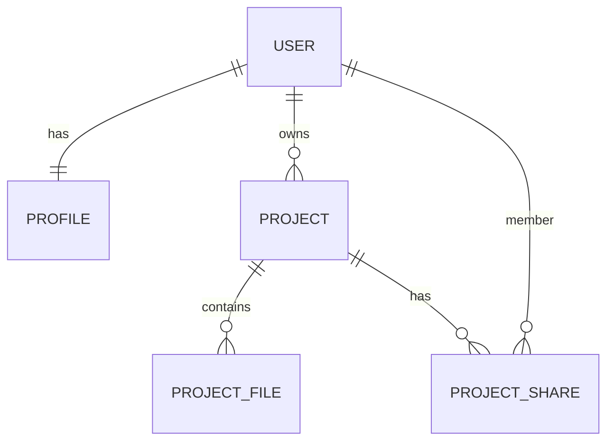
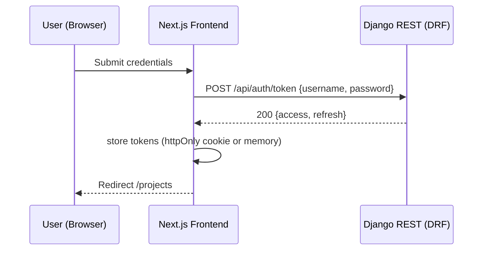
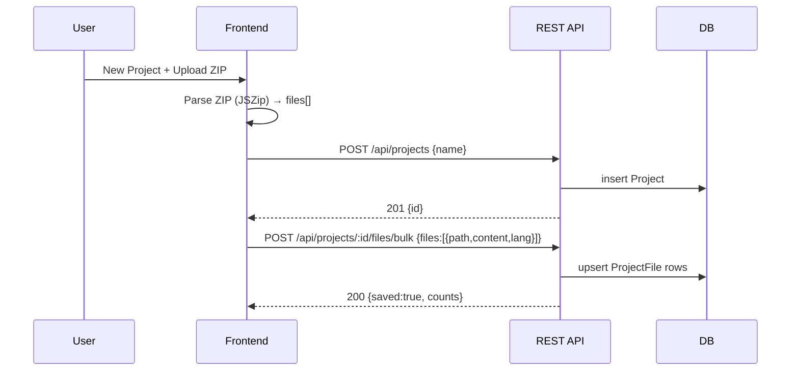
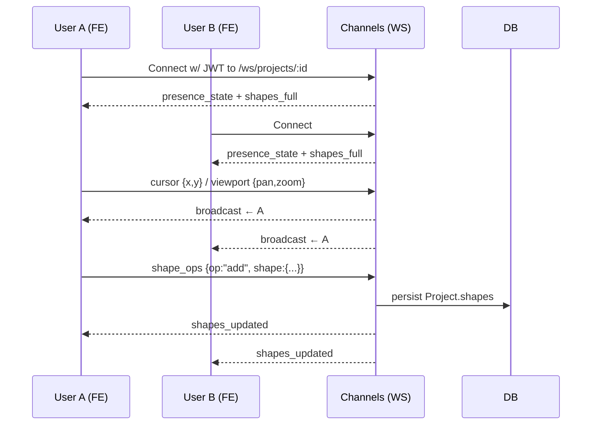

# Stage 3 — Technical Documentation

> Project: **Code Graph Explorer (MVP)**  
> Date: 2025‑09‑15  
> Authors: Team C#26 (Jerome Tran, Ryota Higa, Pierre Lionnel Obiang)

---

## 1) User Stories & Mockups

### 1.1 MoSCoW‑prioritized user stories

**Must‑Have (M)**
1. **As a registered user, I want to create a project from a ZIP/repo,** so that I can visualize a codebase as a graph.
2. **As a user, I want to see files/modules as nodes and imports as edges,** so that I can understand structure at a glance.
3. **As a user, I want to pan/zoom and reposition nodes,** so that I can arrange the graph for my mental model.
4. **As a user, I want to save the layout and annotations (shapes/labels),** so that my changes persist.
5. **As a user, I want JWT‑based sign‑in/out,** so that my projects are private and attributable.
6. **As a user, I want to share a project as viewer or editor,** so that others can review or collaborate.
7. **As collaborators, we want realtime presence (cursors) and view sync,** so that we can co‑explore live.

**Should‑Have (S)**
8. **As a user, I want to search nodes by name/extension,** so that I can quickly find files.
9. **As a user, I want to toggle visibility by folder or extension,** to declutter the graph.
10. **As collaborators, we want an inline chat panel,** to discuss while exploring.
11. **As a user, I want to import a project from a local folder (drag‑and‑drop),** as an alternative to ZIP.

**Could‑Have (C)**
12. **As a user, I want function‑level colorization and call‑outs,** to spot hotspots.
13. **As a user, I want WebRTC screen‑follow (follow presenter’s viewport),** to assist walkthroughs.
14. **As a user, I want basic code previews for selected nodes,** to see context without leaving the graph.

**Won’t‑Have (W) for MVP**
15. GitHub/GitLab repo cloning & indexing (post‑MVP).
16. Full code editing/committing in‑app.
17. Large‑repo semantic analysis (LSP/AST indexing) beyond simple import parsing.
18. OSINT and Pico microcontroller demos are **out‑of‑scope** for the MVP (kept in repo but not part of this deliverable).

### 1.2 Mockups (wireframe‑level)

> **Note**: We use simple text/ASCII wireframes to communicate intent. Visual polish will be done later in Figma.

**A. Projects List**
```
+-------------------------------------------------------------+
|  Header [User ▾] [New Project] [Search]                     |
+-------------------------+-----------------------------------+
|  My Projects            |  [Card] Project A  (owner)        |
|  Shared With Me         |  [Card] Project B  (editor)       |
|                         |  [Card] Project C  (viewer)       |
+-------------------------+-----------------------------------+
```

**B. Graph Explorer**
```
+----------------------------------------------------------------------------------+
| Header: [Project Name]    [Share] [Chat] [Save] [Fullscreen]                     |
+---------+------------------------------------------------------------------+-----+
| Sidebar |  (Cytoscape canvas: nodes = files, edges = imports)              | Info|
| Filters |  - Pan/zoom                                                      | Pane|
| Search  |  - Drag nodes; rect/line annotations overlay                     |     |
+---------+------------------------------------------------------------------+-----+
| Footer: Status (peers: ryota, jerome), parse time, node/edge counts              |
+----------------------------------------------------------------------------------+
```

**C. Share Modal**
```
+----------------------------+
| Share “Project A”          |
| [Add user: @name] [role ▾] |
| Viewers:  @u1, @u2         |
| Editors:  @e1              |
| [Copy read‑only link]      |
+----------------------------+
```

---

## 2) System Architecture

### 2.1 High‑level architecture & data flow
```mermaid
flowchart LR
  subgraph Client[Browser — Next.js 14 (React)]
    UI[Graph UI (Cytoscape)]
    AuthUI[Auth Pages]
    ZIP[ZIP Parser (JSZip)]
    RTC[WS Client (presence/chat/shapes)]
  end

  subgraph Edge[Reverse Proxy — Caddy]
    routeREST[/Route: /api/* → DRF/]
    routeWS[/Route: /ws/* → Channels/]
    assets[Static/Assets]
  end

  subgraph Backend[Django 5 / DRF / Channels (ASGI)]
    DRF[REST API]
    CH[WebSocket Hub]
    JWT[SimpleJWT]
  end

  DB[(DB: SQLite → PostgreSQL)]
  Media[(Media Storage: local → S3 compatible)]
  Cache[(Redis — Channels layer, staging/prod)]

  %% Data flows
  UI -- "HTTPS JSON + JWT" --> routeREST
  routeREST --> DRF
  AuthUI -- "POST /api/auth/*" --> routeREST
  UI -- "WS JSON + JWT" --> routeWS
  routeWS --> CH
  DRF -- "ORM (CRUD)" --> DB
  CH -- "persist shapes & presence snapshots" --> DB
  DRF -- "file uploads (multipart)" --> Media
  CH -- "pub/sub" --- Cache

  %% Static assets
  assets -. "SSR/CSR app bundles" .- UI
```

### 2.2 Notes on scalability & reliability
- **Horizontally scalable**: ASGI workers behind Caddy; WebSockets coordinated by **Redis** channel layer in staging/prod.
- **DB migration path**: Start with **SQLite** (dev) → **PostgreSQL** (staging/prod) for JSONB indexes on `positions`/`shapes`.
- **Stateless REST** with **JWT**; short‑lived access tokens + refresh endpoint.
- **Resilience**: WS auto‑reconnect w/ exponential backoff; idempotent bulk file upserts; capped in‑memory chat backlog.
- **Security**: HTTPS everywhere; DRF permissions (Owner/Editor/Viewer); per‑project WS authorization.

### 2.3 Key data flows (annotated)
1. **Auth**: Client → `POST /api/auth/token` → JWT pair → stored (httpOnly cookie or memory) → attached to REST/WS.
2. **Import**: Client parses ZIP (JSZip) → `POST /api/projects/:id/files/bulk` (JSON) → server upserts `ProjectFile` rows.
3. **Explore**: Client requests project → REST returns `Project`, optional file list → UI renders Cytoscape graph.
4. **Collaborate**: Client opens `wss://…/ws/projects/:id` → presence & shapes state → cursor/viewport/shape diffs broadcast.

---

## 3) Components, Classes, and Database Design

### 3.1 Back‑end (Django/DRF/Channels)
**Core models**

| Model | Key fields (type) | Constraints & notes |
|---|---|---|
| `User` | from `django.contrib.auth` | used for auth & ownership |
| `Profile` | `user`(OneToOne), `bio`(Text, null), `avatar`(Image), `created_at` | 1:1 with user |
| `Project` | `id` PK, `owner`(FK User), `name`(Char 100), `positions`(JSON), `shapes`(JSON), `created_at`, `updated_at` | `UniqueConstraint(owner, name)` |
| `ProjectShare` | `project`(FK), `user`(FK), `role`(Char: `viewer`\|`editor`), `created_at` | `UniqueConstraint(project, user)` |
| `ProjectFile` | `id` PK, `project`(FK), `path`(Char 512), `content`(Text), `size`(Int), `lang`(Char 32), `sha1`(Char 40), `created_at`, `updated_at` | `UniqueConstraint(project, path)`; index `(project, path)` |

**Selected services/classes**
- `JWTAuthentication` (SimpleJWT) — obtains/refreshes tokens.
- `ProjectPermissions` — owner/editor/viewer guards per endpoint.
- `BulkFileSerializer` — validates `{path, content, size?, lang?}` items; upserts efficiently.
- `ProjectConsumer` (Channels):
  - `connect()` validates JWT & project membership.
  - `receive_json(message)` routes by `type` to handlers: `cursor`, `viewport`, `shape_ops`, `chat`, etc.
  - `persist_shapes()` debounced save to `Project.shapes`.
  - `disconnect()` cleans presence.

**Representative DRF viewsets**
- `ProjectViewSet` (list/create/retrieve/update/destroy)
- `ProjectFileBulkView` (`POST files/bulk`)
- `ShareProjectView` (`POST share`)
- `AuthViewSet` (`register`, `me`, `avatar`)

### 3.2 Database ER diagram & schema


**DDL (relational, PostgreSQL)**
```sql
CREATE TABLE project (
  id BIGSERIAL PRIMARY KEY,
  owner_id BIGINT NOT NULL REFERENCES auth_user(id) ON DELETE CASCADE,
  name VARCHAR(100) NOT NULL,
  positions JSONB NOT NULL DEFAULT '{}'::jsonb,
  shapes JSONB NOT NULL DEFAULT '[]'::jsonb,
  created_at TIMESTAMPTZ DEFAULT now(),
  updated_at TIMESTAMPTZ DEFAULT now(),
  UNIQUE(owner_id, name)
);

CREATE TABLE project_share (
  id BIGSERIAL PRIMARY KEY,
  project_id BIGINT NOT NULL REFERENCES project(id) ON DELETE CASCADE,
  user_id BIGINT NOT NULL REFERENCES auth_user(id) ON DELETE CASCADE,
  role VARCHAR(10) NOT NULL CHECK (role IN ('viewer','editor')),
  created_at TIMESTAMPTZ DEFAULT now(),
  UNIQUE(project_id, user_id)
);

CREATE TABLE project_file (
  id BIGSERIAL PRIMARY KEY,
  project_id BIGINT NOT NULL REFERENCES project(id) ON DELETE CASCADE,
  path VARCHAR(512) NOT NULL,
  content TEXT NOT NULL,
  size INTEGER NOT NULL DEFAULT 0,
  lang VARCHAR(32) NOT NULL DEFAULT 'text',
  sha1 CHAR(40),
  created_at TIMESTAMPTZ DEFAULT now(),
  updated_at TIMESTAMPTZ DEFAULT now(),
  UNIQUE(project_id, path)
);
CREATE INDEX idx_project_file_project_path ON project_file(project_id, path);
```

### 3.3 Front‑end components (Next.js + React)
**Core components & responsibilities**
- `GraphCanvas` — wraps Cytoscape; renders nodes/edges; handles drag, zoom, tap; emits `nodeMove`, `shapeOp`.
- `SidebarFilters` — toggles by folder/extension; sets visibility; emits `filterChange`.
- `NodeSearch` — fuzzy search by name/path; focuses node.
- `InfoPane` — shows selected node metadata and quick code preview (optional).
- `ShareDialog` — add/remove viewers/editors; calls REST.
- `ChatPanel` — inline chat; streams via WS.
- `RealtimeProvider` — opens WS; exposes hooks for `presence`, `cursor`, `viewport`.
- `AuthProvider` — JWT storage/refresh; injects `Authorization` on REST/WS.
- `ProjectsList` / `ProjectCard` — list & open projects.
- `ZipImport` — reads ZIP in browser (JSZip) and posts bulk payloads.

**Interactions overview**
```mermaid
flowchart TD
  ZipImport -->|files[]| ApiClient
  ApiClient -->|POST bulk| Backend
  GraphCanvas -->|shapeOps/nodeMove| RealtimeProvider
  RealtimeProvider -->|WS broadcast| BackendWS
  BackendWS -->|rebroadcast| GraphCanvas
  SidebarFilters --> GraphCanvas
  NodeSearch --> GraphCanvas
  ShareDialog --> ApiClient
```

---

## 4) High‑Level Sequence Diagrams

### 4.1 User logs in (JWT)


### 4.2 Import ZIP & save files


### 4.3 Realtime collaboration (cursor + shapes)


---

## 5) API Specifications

### 5.1 External APIs
- **None required for MVP.** (Future: Git provider APIs for cloning/import.)

### 5.2 Internal REST API (DRF)

| Endpoint | Method | Auth | Input | Output | Notes |
|---|---|---|---|---|---|
| `/api/auth/register` | POST | No | `{username, email?, password}` | `201 {id, username}` | Create user |
| `/api/auth/token` | POST | No | `{username, password}` | `{access, refresh}` | Obtain JWT |
| `/api/auth/token/refresh` | POST | No | `{refresh}` | `{access}` | Refresh access |
| `/api/auth/me` | GET | Bearer | — | `{id, username, profile}` | Current user |
| `/api/auth/me` | PUT | Bearer | `{bio}` | `{profile}` | Update profile |
| `/api/auth/avatar` | POST (multipart) | Bearer | `file` | `{url}` | Upload avatar |
| `/api/projects/` | GET | Bearer | — | `[{id,name,counts,my_role}]` | Owned projects |
| `/api/projects/shared-with-me/` | GET | Bearer | — | `[...]` | Shared projects |
| `/api/projects/` | POST | Bearer | `{name}` | `201 {id,name}` | Create project |
| `/api/projects/:id/` | GET | Bearer | — | `{project,...}` | Detail (+ optional files) |
| `/api/projects/:id/` | PATCH | Bearer (owner/editor) | `{name?, positions?, shapes?}` | `{project}` | Update meta/layout/shapes |
| `/api/projects/:id/` | DELETE | Bearer (owner) | — | `204` | Remove project |
| `/api/projects/:id/files/bulk` | POST | Bearer (owner/editor) | `{files:[{path,content,lang?}]}` | `{saved:true, counts}` | Upsert files |
| `/api/projects/:id/file` | POST | Bearer (owner/editor) | `{path,content,lang?}` | `{saved:true}` | Upsert single |
| `/api/projects/:id/share` | POST | Bearer (owner) | `{viewers:[username], editors:[username]}` | `{ok:true}` | Update share lists |

**Common response fragments**
```json
// Project
{"id": 42, "name": "demo", "owner": {"id":7, "username":"alice"},
 "counts": {"files": 128}, "my_role": "owner",
 "positions": {"src/index.ts": {"x":120, "y":220}},
 "shapes": [{"id":"r1","type":"rect","x":200,"y":120,"w":300,"h":160,"label":"Auth"}]}
```

### 5.3 WebSocket API (Channels)
- **URL**: `wss://<host>/ws/projects/:project_id/`
- **Auth**: `Authorization: Bearer <access>` header, or `?token=<access>` query.

| Type | Direction | Payload schema |
|---|---|---|
| `presence_state` | S→C | `{peers:[{id,username,color}]}` |
| `chat_history` | S→C | `{messages:[{id,text,ts,user:{...}}]}` |
| `shapes_full` | S→C | `{shapes:[...]}` |
| `cursor` | C↔S | `{x:number,y:number}` |
| `viewport` | C↔S | `{panX:number, panY:number, zoom:number}` |
| `node_move` | C→S | `{path:string,x:number,y:number}` (rebroadcast) |
| `shape_ops` | C→S | `{op:"add|update|remove", shape:{...}}` → persisted + rebroadcast |
| `chat` | C→S | `{text:string}` → appended & rebroadcast with server `user`/`ts` |

---

## 6) SCM & QA Strategies

### 6.1 Source Control (Git)
- **Branching**: Trunk‑based — `main` (protected); short‑lived `feat/*`, `fix/*`, `chore/*` branches.
- **Commits**: Conventional Commits; small, focused; reference issue IDs.
- **PRs**: Required checks + 1 reviewer; squash‑merge to keep history clean.
- **Environments**: `dev` (SQLite), `staging` (Postgres + Redis), `prod` (Postgres + Redis).

### 6.2 CI/CD
- **CI** (GitHub Actions):
  1) Lint: Black, isort, flake8 (backend); ESLint + TypeScript (frontend).  
  2) Test: `pytest` (DRF, perms), Channels WS tests; React Testing Library; Playwright (smoke E2E).  
  3) Build: Next.js; collectstatic.  
  4) Artifact: Docker images for `backend` & `frontend`.
- **CD**: Auto‑deploy `main` to staging; manual promotion to prod. DB migrations via `manage.py migrate`.

### 6.3 QA Plan
- **Unit tests**: models/serializers/permissions; UI utils and hooks.
- **Integration tests**: REST contracts; WS handshake & message routing.
- **E2E tests**: login → create project → import ZIP → open graph → share → realtime cursor.
- **Performance checks**: render ≤500 nodes <2s; WS round‑trip <250ms on EU regions.
- **Security**: authz tests (owner/editor/viewer); JWT expiry/refresh; basic rate limits on auth and bulk upload.
- **Coverage goal**: backend ≥80%, frontend ≥70% by end of MVP.

### 6.4 Tooling
- **Linters/formatters**: Black, isort, flake8; ESLint, Prettier.
- **Static typing**: mypy (backend, optional), TypeScript strict (frontend).
- **Monitoring (staging/prod)**: structured logs; optional Sentry.
- **API inspection**: Postman or HTTPie collections committed in `docs/`.

---

## 7) Technical Justifications
- **Django + DRF** chosen for fast CRUD, established auth, and maintainability.
- **Channels/WebSockets** preferred over polling for low‑latency collaboration features.
- **Cytoscape** offers stable graph performance vs. manual D3.
- **SimpleJWT** gives SPA‑friendly tokens; WS middleware supports header/query/cookie for flexibility in dev and demos.
- **SQLite → Postgres** path keeps MVP simple while allowing scale up.
- **Client‑side ZIP parse (JSZip)** minimizes backend load and simplifies uploads.
- **Mermaid‑documented diagrams** improve shared understanding and keep docs versionable.

---

## 8) Non‑Functional Requirements
- **Security**: Auth required for all project endpoints; sharing follows least privilege.
- **Privacy**: No public project listing; read‑only shared links optional and time‑boxed (post‑MVP).
- **Reliability**: WS reconnect with exponential backoff; idempotent bulk upserts.
- **Performance**: Target <2s initial render for ≤500 nodes on modern laptop; lazy edge rendering for large graphs.
- **Usability**: Keyboard shortcuts for zoom/reset; accessible colors & labels.

---

## 9) Implementation Checklist (MVP)
- [ ] Auth (register/login/me/avatar)
- [ ] Projects CRUD
- [ ] Bulk file import (ZIP → files → bulk API)
- [ ] Graph view (Cytoscape), search/filter
- [ ] Positions & shapes persistence
- [ ] Share (viewer/editor)
- [ ] Realtime presence/cursor/viewport + chat
- [ ] Basic tests + CI

---

## 10) Appendix — Example Schemas

**Project (detail)**
```json
{
  "id": 42,
  "name": "app‑core",
  "owner": {"id": 7, "username": "alice"},
  "editors": [{"id": 8, "username": "bob"}],
  "viewers": [{"id": 9, "username": "carol"}],
  "positions": {"src/index.ts": {"x": 100, "y": 240}},
  "shapes": [
    {"id": "r1", "type": "rect", "x": 200, "y": 120, "w": 300, "h": 160, "color": "#88f", "label": "Auth"},
    {"id": "l1", "type": "line", "x1": 350, "y1": 300, "x2": 700, "y2": 320}
  ]
}
```

**WebSocket chat message (broadcast)**
```json
{
  "type": "chat",
  "data": {
    "id": "93d1…",
    "text": "Check the util.ts cycle",
    "ts": "2025‑09‑14T12:34:56Z",
    "user": {"id": 8, "username": "bob", "color": "#6c7"}
  }
}
```
